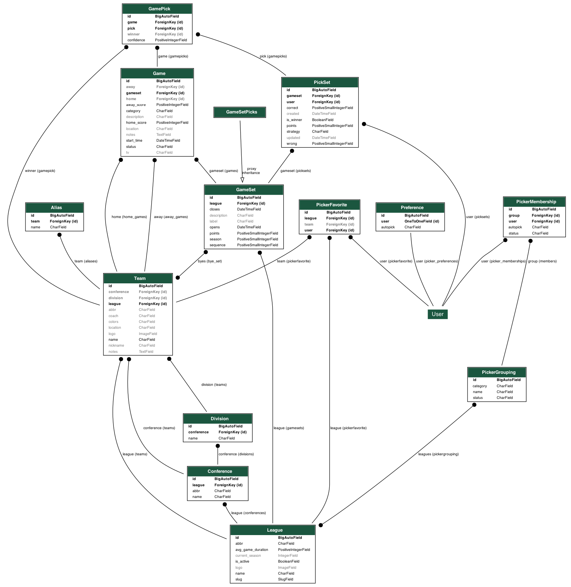

django-picker
=============

.. image:: https://github.com/dakrauth/picker/workflows/Test/badge.svg
    :target: https://github.com/dakrauth/picker/actions

A Django-based sports picker app for various leagues (NFL, English Premier, etc).

Templates
---------

The included templates are all `Bootstrap 5 <http://getbootstrap.com/>`_ based.

Demo
----

For Linux/Mac OS X:

.. code-block:: bash

    $ git clone https://github.com/dakrauth/django-picker.git
    $ cd django-picker
    $ docker-compose up --build

Browse to: http://127.0.0.1:8008

User ``demo``, password ``demo`` has management rights. Users [``user1``, ``user2``, ..., ``user9``]
all share password ``password``.

Development
-----------

For convenience, please install `just <https://github.com/casey/just>`_.

.. code-block:: bash

    $ git clone https://github.com/dakrauth/django-picker.git
    $ cd django-picker

    # Show all available recipes
    $ just

Build and execute the demo in a Docker container:

.. code-block:: bash

    $ just docker-build
    $ just docker-run

To test:

.. code-block:: bash

    $ just test

    # or

    $ just retest

    # or, for all tox tests

    $ just tox

Meta
----

:Version: 2.3.0
:Requirements: Python >= 3.10, Django >= 4.2
:License: MIT (see ``LICENSE`` file for more information)
:Source: https://github.com/dakrauth/django-picker

Database Schema
~~~~~~~~~~~~~~~

